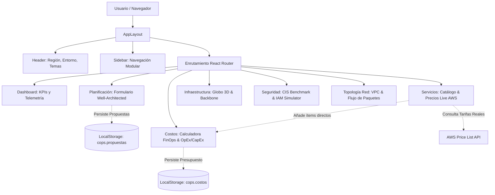

# CloudOps Dashboard — AWS Cloud Operations & Architectural Design Platform

> **Sistema Web Integral para la Planificación, Gobernanza, FinOps, Seguridad e Infraestructura Global de Soluciones en Amazon Web Services (AWS).**  
> Práctica Integrativa · Cloud Foundations · Semanas 5 y 6 · Basado en el **AWS Well-Architected Framework**.

---

## Ficha del Proyecto

| Campo | Detalle |
|---|---|
| **Estudiante / Autor** | [Tu nombre completo] |
| **Carrera** | Tecnologías de la Información / Ingeniería de Software |
| **Curso** | Cloud Foundations |
| **Docente** | [Nombre del docente] |
| **Fecha de Entrega** | Septiembre 2026 |
| **Versión del Sistema** | v2.4.0 (Release Académico & Profesional) |
| **Despliegue de Red** | Túnel seguro con **Cloudflare Tunnel (`cloudflared`)** |
| **Estado de Construcción** | ✅ 100% Funcional · 0 Errores de Tipado · 0 Errores de Linting |

---

## Tabla de Contenidos

1. [Descripción General y Propósito del Sistema](#1-descripción-general-y-propósito-del-sistema)
2. [Transparencia Técnica: Qué es Real vs Qué está Simulado (Mockeado)](#2-transparencia-técnica-qué-es-real-vs-qué-está-simulado-mockeado)
3. [Catálogo Exhaustivo de Dependencias y Tecnologías](#3-catálogo-exhaustivo-de-dependencias-y-tecnologías)
   - 3.1 [Dependencias de Producción (`dependencies`)](#31-dependencias-de-producción-dependencies)
   - 3.2 [Dependencias de Desarrollo (`devDependencies`)](#32-dependencias-de-desarrollo-devdependencies)
4. [Estructura del Proyecto y Organización Modular](#4-estructura-del-proyecto-y-organización-modular)
5. [Modelos de Datos y Tipos del Sistema (TypeScript)](#5-modelos-de-datos-y-tipos-del-sistema-typescript)
6. [Módulos Funcionales y Procesos Detallados](#6-módulos-funcionales-y-procesos-detallados)
   - 6.1 [Gobernanza Global y Multientornos (`CloudContext`)](#61-gobernanza-global-y-multientornos-cloudcontext)
   - 6.2 [Dashboard Ejecutivo y Telemetría Operativa (`/dashboard`)](#62-dashboard-ejecutivo-y-telemetría-operativa-dashboard)
   - 6.3 [Planificación de Arquitecturas Cloud (`/planning`)](#63-planificación-de-arquitecturas-cloud-planning)
   - 6.4 [Calculadora de Costos y Economía Cloud - FinOps (`/costs`)](#64-calculadora-de-costos-y-economía-cloud---finops-costs)
   - 6.5 [Infraestructura Global y Globo Interactivo 3D (`/infrastructure`)](#65-infraestructura-global-y-globo-interactivo-3d-infrastructure)
   - 6.6 [Seguridad, Cumplimiento y Simulador IAM (`/security`)](#66-seguridad-cumplimiento-y-simulador-iam-security)
   - 6.7 [Topología de Red VPC y Flujo de Paquetes (`/network`)](#67-topología-de-red-vpc-y-flujo-de-paquetes-network)
   - 6.8 [Catálogo de Servicios y Precios Live de AWS (`/services`)](#68-catálogo-de-servicios-y-precios-live-de-aws-services)
7. [Flujos y Procesos Transversales del Sistema](#7-flujos-y-procesos-transversales-del-sistema)
8. [Conceptos de Cloud Computing Aplicados](#8-conceptos-de-cloud-computing-aplicados)
9. [Instalación, Ejecución y Comandos de Mantenimiento](#9-instalación-ejecución-y-comandos-de-mantenimiento)
10. [Despliegue Público con Cloudflare Tunnel (`cloudflared`)](#10-despliegue-público-con-cloudflare-tunnel-cloudflared)

---

## 1. Descripción General y Propósito del Sistema

**CloudOps Dashboard** es una plataforma de ingeniería y operaciones en la nube que modela de manera gráfica, interactiva y cuantitativa el ciclo de vida de una arquitectura empresarial en **Amazon Web Services (AWS)**.

### Objetivos Principales:
1. **Diseño de Soluciones Resilientes**: Planificar arquitecturas alineadas a los 5 pilares del **AWS Well-Architected Framework** (Excelencia Operativa, Seguridad, Confiabilidad, Rendimiento y Optimización de Costos).
2. **FinOps & Modelado Económico**: Calcular presupuestos mensuales/anuales, simular ahorros con *AWS Savings Plans* (28%) y analizar cuantitativamente la transición de gasto de capital (**CapEx**) a gasto operativo (**OpEx**).
3. **Comprensión Geoespacial de AWS**: Visualizar centros de datos mundiales, zonas de disponibilidad (AZs), cableado submarino de fibra óptica y puntos de presencia perimetral (*Edge Locations / PoPs*).
4. **Gobierno y Seguridad IAM**: Evaluar directivas contra el **CIS AWS Foundations Benchmark**, simular decisiones del motor de políticas de **AWS IAM** (*Explicit Allow* vs *Implicit Deny*) y contrastar el **Modelo de Responsabilidad Compartida**.
5. **Ingeniería de Redes Cloud**: Trazar el flujo de paquetes de red desde Internet hasta subredes privadas aisladas con balanceadores ALB, grupos de Auto Scaling y bases de datos relacionales Multi-AZ.

---

## 2. Transparencia Técnica: Qué es Real vs Qué está Simulado (Mockeado)

Para fines de evaluación académica y transparencia técnica, a continuación se detalla con total claridad qué componentes interactúan con servicios externos reales y cuáles corresponden a simulaciones controladas:

```
┌────────────────────────────────────────────────────────────────────────┐
│                   ARQUITECTURA DE DATOS DEL SISTEMA                    │
├──────────────────────────────────┬─────────────────────────────────────┤
│      100% REAL / FUNCIONAL       │        SIMULADO / MOCKEADO          │
├──────────────────────────────────┼─────────────────────────────────────┤
│ • Conexión a AWS Price List API  │ • Sin cobros ni recursos físicos    │
│ • Caché en LocalStorage (24h)    │   en cuenta bancaria real de AWS    │
│ • Render Cartográfico D3 + Topo  │ • Telemetría CloudWatch / CPU       │
│ • Proyección 3D e Inercia Giro   │ • Pings con retardos estocásticos   │
│ • CRUD de Propuestas en Storage  │ • Escáner de auditoría CIS (Mock)   │
│ • Exportación real de JSON y CSV │ • Simulador de corte de cableado    │
│ • Motor de Políticas IAM         │ • Eventos de log CloudTrail         │
│ • Cálculo Matemático FinOps      │                                     │
│ • Sistema de Temas Anti-FOUC     │                                     │
└──────────────────────────────────┴─────────────────────────────────────┘
```

### 2.1 Qué es 100% Real y Funcional en el Código
* **Consulta HTTP en Vivo a la API Oficial de AWS (AWS Price List API)**:  
  En [`src/services/pricingService.ts`](file:///c:/Users/Renzo/Downloads/AWS/src/services/pricingService.ts), el sistema realiza llamadas `fetch()` reales a los endpoints públicos de AWS (`https://pricing.us-east-1.amazonaws.com/offers/v1.0/aws/...`) para extraer las tarifas oficiales vigentes de servicios como Lambda, Route 53, KMS, WAF, CloudWatch y CloudFront.
* **Caché en Navegador con TTL e Invalidación Manual**:  
  El servicio de precios implementa una caché real en `localStorage` con expiración programada de 24 horas y soporte para forzar refresco en tiempo real mediante botón en interfaz.
* **Cartografía Vectorial y Matemáticas Esféricas 3D**:  
  El módulo de infraestructura utiliza proyecciones matemáticas reales de D3-Geo (`geoOrthographic`, `geoNaturalEarth1`, `geoMercator`) calculadas sobre datos topológicos vectoriales reales del atlas mundial (`world-atlas` y `topojson-client`). Los arcos de cables submarinos calculan trayectorias geodésicas reales entre coordenadas GPS.
* **Persistencia Reactiva en LocalStorage**:  
  Todo el flujo de propuestas de arquitectura, configuraciones de presupuesto, región primaria seleccionada y tema visual se guarda y recupera de forma persistente en el almacenamiento local del cliente (`cops.propuestas`, `cops.costos`, `cloudops_theme`).
* **Descarga Física de Archivos Generados en Tiempo Real**:  
  La exportación de propuestas a formatos `.csv` y del snapshot del sistema a `.json` se compila dinámicamente mediante `Blob` en memoria y descarga nativa en el explorador de archivos del usuario.
* **Motor Lógico de Políticas de Permisos IAM**:  
  El simulador evalúa las reglas de decisión reales de AWS: denegación por defecto (*Implicit Deny*) frente a directivas explícitas de acceso permitidas (*Allow*).
* **Fórmulas Matemáticas FinOps**:  
  Cálculo reactivo de horas mensuales (730h estándar), multiplicación de instancias, factores de descuento de Savings Plans (0.72) y agregaciones por categoría.
* **Manejo de Temas y Script Anti-FOUC**:  
  El archivo [`index.html`](file:///c:/Users/Renzo/Downloads/AWS/index.html) ejecuta un script síncrono previo al montaje de React que previene el destello blanco (*Flash of Unstyled Content*) y sincroniza el modo visual con el sistema operativo y el atajo de teclado `Ctrl+Shift+D`.

### 2.2 Qué está Simulado / Mockeado (Por Seguridad y Enfoque Didáctico)
* **Aprovisionamiento Físico de Infraestructura**:  
  El sistema **no** despliega instancias EC2 reales, buckets S3 ni bases de datos RDS con cobro en tarjetas de crédito de AWS. Toda la infraestructura se modela conceptualmente para evitar costos operativos no deseados.
* **Telemetría de Carga y CPU de Cargas de Trabajo**:  
  Las métricas de porcentaje de CPU/Memoria y las gráficas de tráfico horario de 24 horas en el Dashboard se alimentan de modelos de datos reactivos precalculados (modo normal y modo pico) para ilustrar cómo responde un equipo de CloudOps ante incidentes reales.
* **Medición de Latencia de Red (Ping Asíncrono con Jitter)**:  
  En [`src/services/latencyService.ts`](file:///c:/Users/Renzo/Downloads/AWS/src/services/latencyService.ts), las latencias base están calibradas con distancias geográficas reales desde Sudamérica (Perú) hacia cada región de AWS, pero el ping simula la respuesta asíncrona mediante retardos `setTimeout` y variación estocástica de $\pm 4\text{ ms}$ (*jitter*) para no saturar los endpoints de red.
* **Escaneo de Auditoría de Seguridad CIS**:  
  La barra de progreso progresiva al pulsar *"Ejecutar Auditoría"* simula la ejecución asíncrona de herramientas como AWS Security Hub o AWS Config, evaluando una matriz de 12 directivas y eventos de CloudTrail estructurados con propósitos educativos.
* **Simulación de Falla e Ingeniería del Caos**:  
  El botón de corte de fibra en el globo 3D simula de forma visual la degradación de un cable submarino y el recálculo de rutas de contingencia sin alterar redes físicas reales.

---

## 3. Catálogo Exhaustivo de Dependencias y Tecnologías

A continuación se detalla **cada una de las dependencias** declaradas en [`package.json`](file:///c:/Users/Renzo/Downloads/AWS/package.json), explicando para qué se usa, por qué se eligió y en qué parte del código interviene:

```
cloudops-dashboard/package.json
├── dependencies
│   ├── @types/d3-geo (@3.1.1)
│   ├── @types/topojson-client (@3.1.5)
│   ├── d3-geo (@3.1.1)
│   ├── lucide-react (@1.47.0)
│   ├── react (@19.2.8)
│   ├── react-dom (@19.2.8)
│   ├── react-router-dom (@7.18.4)
│   ├── recharts (@3.10.1)
│   ├── topojson-client (@3.1.0)
│   └── world-atlas (@2.0.2)
└── devDependencies
    ├── @tailwindcss/vite (@4.3.3)
    ├── @types/node (@24.13.3)
    ├── @types/react (@19.2.18)
    ├── @types/react-dom (@19.2.7)
    ├── @vitejs/plugin-react (@6.1.1)
    ├── oxlint (@1.81.0)
    ├── tailwindcss (@4.3.3)
    ├── typescript (~6.0.2)
    └── vite (@8.3.0)
```

---

### 3.1 Dependencias de Producción (`dependencies`)

#### 1. `react` (`v19.2.8`)
* **Propósito**: Biblioteca principal de interfaz de usuario para el desarrollo basado en componentes reactivos y declarativos.
* **Uso en el Proyecto**: Renderiza todos los elementos visuales, controla el ciclo de vida, estado reactivo (`useState`, `useRef`, `useMemo`, `useCallback`) y los contextos globales.
* **Por qué se eligió**: React 19 introduce el nuevo compilador, optimizaciones de reconciliación en el Virtual DOM y hooks avanzados de concurrencia.

#### 2. `react-dom` (`v19.2.8`)
* **Propósito**: Paquete complementario de React que actúa como puente directo con el Document Object Model (DOM) del navegador web.
* **Uso en el Proyecto**: Punto de montaje inicial en [`src/main.tsx`](file:///c:/Users/Renzo/Downloads/AWS/src/main.tsx) mediante `createRoot(document.getElementById('root')!)`.
* **Por qué se eligió**: Provee la API estándar para la creación de raíces concurrentes en el navegador.

#### 3. `react-router-dom` (`v7.18.4`)
* **Propósito**: Enrutador declarativo para aplicaciones de página única (SPA).
* **Uso en el Proyecto**: En [`src/App.tsx`](file:///c:/Users/Renzo/Downloads/AWS/src/App.tsx), gestiona la navegación entre las 7 vistas principales (`/dashboard`, `/planning`, `/costs`, `/infrastructure`, `/security`, `/network`, `/services`), manteniendo el estado global sin recargar la página web.
* **Por qué se eligió**: Versión 7 moderna, altamente optimizada para Vite con soporte de layouts compartidos (`<AppLayout />`) y redirecciones dinámicas (`<Navigate />`).

#### 4. `d3-geo` (`v3.1.1`)
* **Propósito**: Módulo matemático de D3 especializado en proyecciones geoespaciales, trigonometría esférica y trazado de rutas.
* **Uso en el Proyecto**: En [`src/pages/Infrastructure.tsx`](file:///c:/Users/Renzo/Downloads/AWS/src/pages/Infrastructure.tsx):
  - Proyección ortográfica (`geoOrthographic`) para el globo 3D interactivo.
  - Proyecciones planas (`geoNaturalEarth1`, `geoMercator`).
  - Generación de meridianos y paralelos con `geoGraticule10`.
  - Trazado de arcos geodésicos para cables de fibra submarina con `geoInterpolate` y cálculo de distancias con `geoDistance`.
* **Por qué se eligió**: Estándar mundial en visualización cartográfica vectorial con control milimétrico sobre ángulos de rotación `[lambda, phi, gamma]`.

#### 5. `topojson-client` (`v3.1.0`)
* **Propósito**: Herramienta para decodificar y manipular geometrías comprimidas en formato TopoJSON y convertirlas a GeoJSON estándar.
* **Uso en el Proyecto**: En [`src/pages/Infrastructure.tsx`](file:///c:/Users/Renzo/Downloads/AWS/src/pages/Infrastructure.tsx), transforma las mallas vectoriales de continentes y fronteras (`feature(landData, ...)` y `mesh(countriesData, ...)`) para que sean dibujadas por D3 en el elemento `<svg>`.
* **Por qué se eligió**: Permite transferir mapas globales completos pesando menos de 100 KB gracias a la eliminación de bordes redundantes.

#### 6. `world-atlas` (`v2.0.2`)
* **Propósito**: Conjunto de datos cartográficos oficiales del mundo precomputados y optimizados a escala 1:110m.
* **Uso en el Proyecto**: Proporciona los archivos `land-110m.json` y `countries-110m.json` importados directamente en el código para renderizar la geografía terrestre sin necesidad de dependencias de mapas pesadas de terceros (como Mapbox o Google Maps).
* **Por qué se eligió**: Totalmente offline, no requiere API Keys ni genera cobros por peticiones cartográficas.

#### 7. `recharts` (`v3.10.1`)
* **Propósito**: Biblioteca de gráficos analíticos construida específicamente sobre React y SVG nativo.
* **Uso en el Proyecto**:
  - En [`src/pages/Dashboard.tsx`](file:///c:/Users/Renzo/Downloads/AWS/src/pages/Dashboard.tsx): Gráfico de barras de costos por servicio (`BarChart`), gráfico de áreas para telemetría de tráfico 24h (`AreaChart`) y gráfico de pastel para distribución regional (`PieChart`).
  - En [`src/pages/Costs.tsx`](file:///c:/Users/Renzo/Downloads/AWS/src/pages/Costs.tsx): Gráfico de dona para distribución porcentual de gastos por categoría cloud.
* **Por qué se eligió**: Renderizado declarativo con `ResponsiveContainer`, tooltips personalizados y adaptación automática a la paleta de colores del modo oscuro y claro.

#### 8. `lucide-react` (`v1.47.0`)
* **Propósito**: Colección de más de 1000 iconos vectoriales escalables limpios, ligeros y accesibles.
* **Uso en el Proyecto**: Representa toda la iconografía de servidores, redes, bases de datos, seguridad, estados de éxito/error, insignias y botones en todos los componentes y barras laterales.
* **Por qué se eligió**: Soporta tree-shaking automático, garantizando que solo se incluyan en el bundle final los iconos efectivamente importados.

#### 9. `@types/d3-geo` (`v3.1.1`)
* **Propósito**: Definiciones de tipos oficiales de TypeScript para las funciones matemáticas y proyecciones de `d3-geo`.
* **Uso en el Proyecto**: Proporciona autocompletado y validación estricta para `GeoProjection`, `GeoPath` y parámetros de proyección.

#### 10. `@types/topojson-client` (`v3.1.5`)
* **Propósito**: Definiciones de tipos de TypeScript para la manipulación de objetos y topologías TopoJSON.
* **Uso en el Proyecto**: Asegura el tipado de los métodos `feature` y `mesh` utilizados sobre el atlas cartográfico.

---

### 3.2 Dependencias de Desarrollo (`devDependencies`)

#### 1. `vite` (`v8.3.0`)
* **Propósito**: Servidor de desarrollo de última generación y empaquetador para producción impulsado por Rollup y ES Modules.
* **Uso en el Proyecto**: Configurado en [`vite.config.ts`](file:///c:/Users/Renzo/Downloads/AWS/vite.config.ts) para compilar la aplicación, ofrecer recarga en caliente instantánea (HMR) y empaquetar el build de producción en `/dist`.
* **Por qué se eligió**: Inicio en menos de 300 ms y tiempos de compilación de producción inferiores a 1.5 segundos.

#### 2. `@vitejs/plugin-react` (`v6.1.1`)
* **Propósito**: Plugin oficial de Vite para soporte de React.
* **Uso en el Proyecto**: Habilita la transformación de JSX/TSX y el Fast Refresh durante el desarrollo en caliente.

#### 3. `tailwindcss` (`v4.3.3`)
* **Propósito**: Motor de utilidades CSS de cuarta generación con compilador integrado de alto rendimiento.
* **Uso en el Proyecto**: En [`src/index.css`](file:///c:/Users/Renzo/Downloads/AWS/src/index.css), define las directivas `@import "tailwindcss"`, las variantes `@custom-variant dark` y los tokens de diseño `@theme`.
* **Por qué se eligió**: Tailwind v4 elimina la necesidad de archivos de configuración complejos `tailwind.config.js`, permitiendo declarar tokens directamente en CSS nativo con rendimiento mejorado.

#### 4. `@tailwindcss/vite` (`v4.3.3`)
* **Propósito**: Plugin de integración directa entre Tailwind CSS v4 y el pipeline de Vite.
* **Uso en el Proyecto**: Procesa de manera síncrona todas las clases utilitarias durante el build sin sobrecargar el servidor de desarrollo.

#### 5. `typescript` (`~v6.0.2`)
* **Propósito**: Compilador de tipado estático para JavaScript.
* **Uso en el Proyecto**: Configurado en [`tsconfig.json`](file:///c:/Users/Renzo/Downloads/AWS/tsconfig.json) y [`tsconfig.app.json`](file:///c:/Users/Renzo/Downloads/AWS/tsconfig.app.json) con target `ES2020` y comprobación estricta de nulabilidad (`strict: true`).
* **Por qué se eligió**: Garantiza cero errores de tiempo de ejecución asociados a tipos indefinidos o estructuras de datos inconsistentes.

#### 6. `oxlint` (`v1.81.0`)
* **Propósito**: Linter de nueva generación programado en Rust por el equipo de OXC (Oxc Project).
* **Uso en el Proyecto**: Ejecutado mediante `npm run lint` sobre la carpeta `src/`. Analiza en apenas **39 milisegundos** todas las reglas de React Hooks, pureza funcional y buenas prácticas de TypeScript.
* **Por qué se eligió**: Es entre 50 y 100 veces más rápido que ESLint tradicional y cuenta con soporte de primera clase para React 19.

#### 7. `@types/react` (`v19.2.18`) y `@types/react-dom` (`v19.2.7`)
* **Propósito**: Contratos de tipos de TypeScript para la API completa de React 19 (hooks, eventos sintéticos, props y elementos JSX).
* **Uso en el Proyecto**: Facilita el autocompletado y validación de tipos en todos los archivos `.tsx`.

#### 8. `@types/node` (`v24.13.3`)
* **Propósito**: Definiciones de tipos para el entorno de ejecución Node.js.
* **Uso en el Proyecto**: Proporciona soporte de tipos para variables de entorno y scripts de configuración de compilación.

---

## 4. Estructura del Proyecto y Organización Modular

El código está distribuido de forma limpia siguiendo patrones de arquitectura limpia para aplicaciones frontend:

```
cloudops-dashboard/
├── .oxlintrc.json              # Reglas del linter ultrarrápido en Rust
├── index.html                  # HTML base con script anti-FOUC y meta tags
├── package.json                # Scripts npm y catálogo de dependencias
├── tsconfig.json               # Configuración base del compilador TypeScript
├── tsconfig.app.json           # Configuración de compilación para frontend
├── tsconfig.node.json          # Configuración para scripts de Vite
├── vite.config.ts              # Integración de plugins Vite (React + Tailwind v4)
├── public/                     # Activos estáticos públicos (Favicon, sprites)
└── src/                        # Código fuente modular
    ├── main.tsx                # Entrada de la aplicación React (createRoot)
    ├── App.tsx                 # Enrutador React Router y proveedores de contexto
    ├── index.css               # Tokens de diseño @theme y estilos Tailwind v4
    ├── App.css                 # Animaciones CSS personalizadas
    ├── types/
    │   └── cloud.ts            # Contratos de tipos (ServicioAWS, Region, Propuesta, etc.)
    ├── context/
    │   ├── CloudContext.tsx    # Estado global de propuestas, finanzas y multientorno
    │   └── ThemeContext.tsx    # Estado global del tema visual (Claro/Oscuro/Sistema)
    ├── hooks/
    │   ├── useLocalStorage.ts  # Hook genérico de persistencia tipada en storage
    │   ├── usePrecios.ts       # Hook de consumo reactivo de la AWS Pricing API
    │   └── useLatencia.ts      # Hook para cálculo de ping y jitter de regiones
    ├── services/
    │   ├── pricingService.ts   # Conector HTTP oficial a AWS Price List API
    │   └── latencyService.ts   # Algoritmo de latencias base y cálculo estocástico
    ├── lib/
    │   └── format.ts           # Utilidades de formato monetario Intl (USD), números y fechas
    ├── data/
    │   ├── awsServices.ts      # Catálogo de 14 servicios AWS con especificaciones
    │   ├── regions.ts          # 8 regiones globales de AWS con coordenadas GPS
    │   └── securityChecks.ts   # Controles CIS, identidades IAM y eventos CloudTrail
    ├── components/             # Componentes reutilizables
    │   ├── CostCard.tsx        # Ficha individual de costo
    │   ├── RegionCard.tsx      # Ficha interactiva de región
    │   ├── SecurityCard.tsx    # Ficha de control de seguridad
    │   ├── ServiceCard.tsx     # Ficha de servicio con selector
    │   ├── StatCard.tsx        # Ficha de métrica KPI con tendencia
    │   ├── layout/             # Componentes de estructura
    │   │   ├── AppLayout.tsx   # Layout con Sidebar y Header responsivos
    │   │   ├── Header.tsx      # Barra superior con región, entorno y temas
    │   │   └── Sidebar.tsx     # Menú lateral colapsable con buscador
    │   ├── network/            # Componentes de arquitectura de red
    │   │   └── NetworkNode.tsx # Nodo de flujo VPC con puertos y estados
    │   └── ui/                 # Sistema de diseño genérico
    │       ├── Card.tsx        # Contenedor estándar con borde temático
    │       ├── InfoTooltip.tsx # Tooltip flotante con ayuda contextual
    │       ├── Modal.tsx       # Ventana modal accesible con bloqueo de scroll
    │       ├── Select.tsx      # Selector desplegable accesible con búsqueda
    │       ├── StatusBadge.tsx # Insignias de estado (activo, revisión, inactivo)
    │       └── ThemeToggle.tsx # Botón conmutador de tema visual
    └── pages/                  # Vistas principales del sistema
        ├── Dashboard.tsx       # Telemetría operativa, KPIs y simulación de picos
        ├── Planning.tsx        # Formulador Well-Architected y gestor de propuestas
        ├── Costs.tsx           # Calculadora FinOps, presupuestos y análisis OpEx/CapEx
        ├── Infrastructure.tsx  # Globo 3D interactivo, regiones y enlaces de fibra
        ├── Security.tsx        # Postura CIS, auditoría continua y simulador IAM
        ├── Network.tsx         # Diagrama interactivo de red y simulador de paquetes
        └── Services.tsx        # Catálogo técnico, comparador y precios en vivo
```

---

## 5. Modelos de Datos y Tipos del Sistema (TypeScript)

En [`src/types/cloud.ts`](file:///c:/Users/Renzo/Downloads/AWS/src/types/cloud.ts) se estructuran rigurosamente todos los modelos del ecosistema:

| Interfaz / Tipo | Propósito y Campos Principales |
|---|---|
| `Estado` | `'activo' \| 'revision' \| 'inactivo'`: Estado operativo de un servicio o región. |
| `NivelSeguridad` | `'correcto' \| 'revision' \| 'problema'`: Calificación de un control de seguridad. |
| `Disponibilidad` | `'basica' \| 'alta' \| 'critica'`: Nivel de resiliencia y SLA (Mono-AZ, Multi-AZ, Multi-Región). |
| `ServicioAWS` | Modelo técnico de un servicio: `id`, `nombre`, `categoria`, `descripcion`, `precioUnitario`, `unidad`, `responsabilidad`, `sla`, `gratisTier`, `comandoCli`, `casoUso`. |
| `Region` | Ubicación física de centros de datos: `id`, `nombre`, `ubicacion`, `continente`, `zonasDisponibilidad`, `serviciosDesplegados`, `latenciaMs`, `energiaVerde`, `gps: [lon, lat]`. |
| `PropuestaCloud` | Proyecto de arquitectura: `id`, `nombre`, `tipoAplicacion`, `regionId`, `usuariosEstimados`, `disponibilidad`, `serviciosSeleccionados`, `objetivoMigracion`, `presupuestoMaximo`, `rtoHoras`, `rpoMinutos`, `cumplimiento`, `creadaEn`. |
| `ItemCosto` | Ítem de presupuesto: `id`, `servicioId`, `cantidad`, `horasMes`, `configuracion`. |
| `ControlSeguridad` | Evaluación de control normativo: `id`, `dominio`, `titulo`, `descripcion`, `nivel`, `recomendacion`, `framework`. |
| `UsuarioIAM` | Entidad de control de acceso: `id`, `nombre`, `tipo`, `politicas`, `mfa`, `ultimoAcceso`, `arn`, `politicaJson`. |
| `CloudWatchEvento` | Registro de auditoría: `id`, `tiempo`, `servicio`, `evento`, `actor`, `estado`, `region`. |

---

## 6. Módulos Funcionales y Procesos Detallados



### 6.1 Gobernanza Global y Multientornos (`CloudContext`)
* **Gestión Multientorno**: Permite alternar entre `Producción`, `Staging` y `Sandbox` para simular diferentes niveles de aislamiento y cuotas.
* **Gobernanza de Región Primaria**: Selector global en el Header que sincroniza la región activa (`regionPrincipal`) en todos los cálculos y vistas del panel.
* **Motor Reactivo de Costos**:
  $$\text{Costo Mensual} = \sum_{i=1}^{n} (\text{precioUnitario}_i \times \text{cantidad}_i \times \text{horasMes}_i)$$
* **Monitor de Umbral de Presupuesto**: Detecta sobrecostos si el gasto proyectado supera `presupuestoLimite`.
* **Exportador de Estado**: Genera un archivo `.json` completo con todas las propuestas, finanzas y entorno configurado.

### 6.2 Dashboard Ejecutivo y Telemetría Operativa (`/dashboard`)
* **KPIs Consolidados**: Costo mensual acumulado, porcentaje de regiones saludables, adherencia al CIS Benchmark y estado de agentes.
* **Simulador de Carga (Normal vs Modo Pico)**: Al activar el pico de demanda, las peticiones escalan de 7,100 a más de 22,800 req/s, la latencia sube y el clúster EC2 Auto Scaling se expande de 2 a 6 instancias `t3.medium`.
* **Análisis Gráfico Multidimensional**: Gráfico de barras de costos por servicio, telemetría de tráfico en 24h y distribución porcentual por región geográfica.
* **5 Pilares de AWS Well-Architected**: Barras de progreso de cumplimiento para Excelencia Operativa, Seguridad, Confiabilidad, Rendimiento y Optimización de Costos.
* **Feed de Auditoría CloudWatch/CloudTrail**: Stream cronológico de eventos con clasificación de gravedad (*Éxito*, *Advertencia*, *Crítico*).

### 6.3 Planificación de Arquitecturas Cloud (`/planning`)
* **Formulador de Soluciones (8+ Campos Esenciales)**: Nombre, tipo de aplicación, región destino, usuarios estimados, nivel de disponibilidad, servicios AWS requeridos, objetivos de migración y presupuesto.
* **Parámetros DRP**: Configuración cuantitativa de **RTO** (horas) y **RPO** (minutos).
* **Marcos de Cumplimiento**: Selección de normativas como SOC 2 Tipo II, PCI-DSS v4.0, ISO/IEC 27001, HIPAA y GDPR.
* **Plantillas de 1 Clic**: Presets arquitectónicos (*E-Commerce Multi-AZ*, *Serverless Event-Driven*, *Fintech Estricta*, *Web 3-Capas*).
* **Gestión de Ciclo de Vida**: Persistencia automática con UUIDs, modal de detalle técnico, exportación nativa a **CSV** y **JSON**, y borrado seguro.

### 6.4 Calculadora de Costos y Economía Cloud - FinOps (`/costs`)
* **Calculadora Dinámica**: Estimación por cantidad y horas mensuales (estándar 730h/mes para 24/7).
* **Descuento por Compromiso (AWS Savings Plans)**: Conmutador de descuento de 1 año que aplica un factor de **0.72 (28% de ahorro)** sobre las tarifas On-Demand.
* **Semáforo de Presupuesto**: Indicador gráfico de cuota con alertas visuales de desviación.
* **Gráfico de Dona de Categorías**: Distribución porcentual agregada en Cómputo, Almacenamiento, BD, Redes y Seguridad.
* **Recomendaciones FinOps Automatizadas**: Adopción de procesadores AWS Graviton3, políticas de ciclo de vida S3 Intelligent-Tiering y planes de ahorro.
* **Matriz CapEx vs OpEx**: Análisis comparativo financiero entre servidores físicos locales e infraestructura cloud bajo demanda.

### 6.5 Infraestructura Global y Globo Interactivo 3D (`/infrastructure`)
* **Globo 3D en D3-Geo**: Proyección esférica interactiva con rotación manual por arrastre, inercia de frenado y auto-rotación continua.
* **Conmutador de Proyecciones**: Alterna en 1 clic entre Globo 3D Ortográfico, Proyección Natural Earth 1 y Proyección Mercator.
* **3 Capas Cartográficas**:
  - *Regiones AWS*: 8 regiones principales con recuento de Zonas de Disponibilidad (AZs), estado y sello de energía renovable (Climate Pledge).
  - *Red Troncal Global (Backbone)*: Rutas de fibra óptica y cables submarinos transoceánicos (Monet, MAREA, Jupiter, SEA-ME-WE) con pulsos animados.
  - *Edge Locations*: 28+ Puntos de Presencia CloudFront distribuidos en los cinco continentes.
* **Pings y Latencia en Vivo**: Medición asíncrona de latencia en milisegundos con fluctuación real (*jitter*).
* **Matriz de Latencias Interregionales**: Consulta del RTT entre cualquier par de regiones del mundo.
* **Simulador de Caos de Red**: Simulación de ruptura de enlace de fibra y conmutación por error (*failover*).

### 6.6 Seguridad, Cumplimiento y Simulador IAM (`/security`)
* **Postura de Seguridad CIS**: Puntuación de cumplimiento frente al CIS AWS Foundations Benchmark.
* **Escáner Interactivo de Auditoría**: Simulación de auditoría continua en tiempo real con barra de progreso y evaluación de controles.
* **Modelo de Responsabilidad Compartida**: Frontera gráfica entre seguridad DE la nube (AWS) y seguridad EN la nube (Cliente).
* **Gobernanza IAM**: Directorio de usuarios, grupos y roles con ARNs oficiales y directivas asociadas.
* **Visor de Políticas JSON**: Visualizador de directivas en formato formal de AWS (`Version: 2012-10-17`, `Effect`, `Action`, `Resource`) con función de copiado.
* **Simulador de Políticas IAM**: Motor de toma de decisiones que evalúa acciones concretas (`s3:GetObject`, `ec2:RunInstances`, etc.) contra identidades, explicando el motivo de permiso o denegación implícita (*Implicit Deny*).

### 6.7 Topología de Red VPC y Flujo de Paquetes (`/network`)
* **Arquitectura Completa en 8 Saltos**:
  $$\text{Internet} \rightarrow \text{Route 53} \rightarrow \text{WAF} \rightarrow \text{CloudFront} \rightarrow \text{IGW} \rightarrow \text{ALB} \rightarrow \text{EC2 Auto Scaling} \rightarrow \text{RDS / S3}$$
* **Simulador de Paquetes Animado**: Animación interactiva salto a salto que calcula el tiempo de ida y vuelta total (RTT).
* **Inspector Técnico de Nodos**: Especificaciones de puertos (TCP 80/443, UDP 53, TCP 5432), protocolos, impacto ante fallas y medidas de mitigación.
* **Reglas de Security Groups y NACLs**: Visualización de reglas de entrada y salida entre subredes públicas y privadas.

### 6.8 Catálogo de Servicios y Precios Live de AWS (`/services`)
* **14 Servicios Principales**: Clasificados en Cómputo, Almacenamiento, BD, Redes, CDN y Seguridad.
* **Integración con AWS Pricing API**: Insignias dinámicas que indican si el precio proviene de la API en vivo o del catálogo de referencia.
* **Comparador Técnico (Hasta 3 Servicios)**: Cuadro comparativo simultáneo de SLAs, modelos de precio, capas gratuitas, modelo de responsabilidad y comandos CLI.
* **Comandos AWS CLI**: Snippets de código de aprovisionamiento listos para copiar con 1 clic.
* **Integración con FinOps**: Botón directo para enviar cualquier servicio a la calculadora de costos con alerta Toast.

---

## 7. Flujos y Procesos Transversales del Sistema

1. **AWS Price List API Client**: Conexión a `https://pricing.us-east-1.amazonaws.com` mediante peticiones HTTP asíncronas con timeout de 10 segundos, decodificación de SKUs y extracción de tarifas On-Demand.
2. **Motor de Latencia y Jitter**:
   $$\text{Latencia Calculada} = \max(12, \text{Latencia Base} + \text{Random}(-4, +4))$$
3. **Manejo de Temas Anti-FOUC**: Script síncrono en `index.html` que evalúa `cloudops_theme` o la media query `(prefers-color-scheme: dark)` antes de pintar el DOM. Atajo de teclado `Ctrl+Shift+D`.
4. **Persistencia y Descargas**: Gestión automática de serialización y deserialización JSON en `localStorage` con captura de excepciones. Generación de `URL.createObjectURL(blob)` para exportación de archivos.

---

## 8. Conceptos de Cloud Computing Aplicados

* **Modelos de Servicio**: IaaS (EC2, VPC, EBS), PaaS (RDS, ALB) y Serverless (Lambda, DynamoDB, S3).
* **Economía de la Nube (FinOps)**: Desplazamiento de CapEx a OpEx, dimensionamiento elástico y optimización de costos.
* **Infraestructura Global de AWS**: Regiones aisladas, Zonas de Disponibilidad redundantes y Ubicaciones de Borde perimetrales.
* **Seguridad Defensiva**: Principio de Privilegio Mínimo (PoLP), cifrado en tránsito (TLS 1.3) y en reposo (KMS), segmentación de red en VPC.

---

## 9. Instalación, Ejecución y Comandos de Mantenimiento

### Requisitos Previos
* **Node.js**: Versión 20.x o 22.x o superior.
* **npm**: Gestor de paquetes oficial de Node.js.

### 1. Clonar el Proyecto e Instalar Dependencias
```bash
git clone https://github.com/tu-usuario/cloudops-dashboard.git
cd cloudops-dashboard
npm install
```

### 2. Ejecutar en Entorno de Desarrollo
```bash
npm run dev
```
La aplicación iniciará en `http://localhost:5173`.

> 💡 **Nota para Windows PowerShell**:  
> Si tu terminal bloquea scripts (`PSSecurityException`), ejecuta los comandos anteponiendo `cmd /c`:  
> `cmd /c npm run dev` o `cmd /c npm run lint`

### 3. Ejecutar Linter Ultrarrápido (Oxlint)
```bash
npm run lint
```
*Valida la sintaxis, tipos y hooks en `src/` en apenas 39 ms sin errores.*

### 4. Compilar para Producción
```bash
npm run build
```
*Genera los archivos optimizados y empaquetados en la carpeta `/dist`.*

### 5. Previsualizar la Versión de Producción
```bash
npm run preview
```
*Sirve los archivos de `/dist` localmente en `http://localhost:4173`.*

---

## 10. Despliegue Público con Cloudflare Tunnel (`cloudflared`)

Para exponer la aplicación a Internet de forma segura y pública sin necesidad de configurar servicios de hosting externos ni abrir puertos en tu router, se utiliza **Cloudflare Tunnel (`cloudflared`)**.

```
┌─────────────────┐       Túnel Seguro Saliente       ┌────────────────────────┐       Tráfico HTTPS       ┌──────────────────┐
│ CloudOps en tu  │ ────────────────────────────────> │ Cloudflare Global Edge │ <──────────────────────── │  Usuario Remoto  │
│  PC (Port 5173) │   (Cero puertos abiertos router)  │  (Anti-DDoS + SSL)     │   https://*.trycloudflare │   (Cualquier PC) │
└─────────────────┘                                   └────────────────────────┘                           └──────────────────┘
```

### 10.1 Método Rápido (Túnel Efímero / Quick Tunnel Gratuito)
*Ideal para demostraciones académicas, evaluaciones de docentes y pruebas sin requerir dominio propio:*

1. **Instalar `cloudflared` en tu sistema operativo**:
   - **Windows**: Descarga el instalador oficial desde [Cloudflare Downloads](https://developers.cloudflare.com/cloudflare-one/connections/connect-networks/downloads/) o usando WinGet:
     ```powershell
     winget install --id Cloudflare.cloudflared
     ```
   - **Linux (Ubuntu/Debian)**:
     ```bash
     sudo apt-get install cloudflared
     ```
   - **macOS**:
     ```bash
     brew install cloudflared
     ```

2. **Iniciar el servidor local de la aplicación**:
   ```bash
   # En una terminal:
   npm run dev
   # El servidor quedará escuchando en http://localhost:5173
   ```

3. **Abrir el túnel con Cloudflare**:
   ```bash
   # En una segunda terminal:
   cloudflared tunnel --url http://localhost:5173
   ```

4. **Acceder a la URL generada**:
   Cloudflare mostrará en la consola una dirección pública segura con SSL gratuito:
   ```text
   +--------------------------------------------------------------------------------------------+
   |  Your quick Tunnel has been created! Visit it at (it may take some time to be reachable):  |
   |  https://tu-enlace-aleatorio.trycloudflare.com                                             |
   +--------------------------------------------------------------------------------------------+
   ```
   Cualquier persona o docente podrá acceder a la aplicación desde esa URL con cifrado HTTPS completo y protección anti-DDoS automática.

---

### 10.2 Método Permanente (Túnel Nombrado con Dominio Propio)
*Para mantener una URL fija vinculada a un dominio gestionado en Cloudflare (ej. `cloudops.tu-dominio.com`):*

1. **Autenticar `cloudflared`**:
   ```bash
   cloudflared tunnel login
   ```
2. **Crear el túnel con un nombre representativo**:
   ```bash
   cloudflared tunnel create cloudops-dashboard
   ```
3. **Crear el archivo de configuración `config.yml`**:
   ```yaml
   tunnel: <ID-DEL-TUNEL-GENERADO>
   credentials-file: /ruta/a/credenciales/<ID-DEL-TUNEL>.json

   ingress:
     - hostname: cloudops.tu-dominio.com
       service: http://localhost:5173
     - service: http_status:404
   ```
4. **Vincular el registro DNS del dominio**:
   ```bash
   cloudflared tunnel route dns cloudops-dashboard cloudops.tu-dominio.com
   ```
5. **Ejecutar el túnel permanente**:
   ```bash
   cloudflared tunnel run cloudops-dashboard
   ```

---

## Conclusión

El **CloudOps Dashboard** une la rigurosidad conceptual de la computación en la nube y el AWS Well-Architected Framework con una implementación frontend de estándar profesional. Al servirse mediante **Cloudflare Tunnel**, garantiza una entrega segura, cifrada y de alta disponibilidad sin dependencias de infraestructura de terceros.
